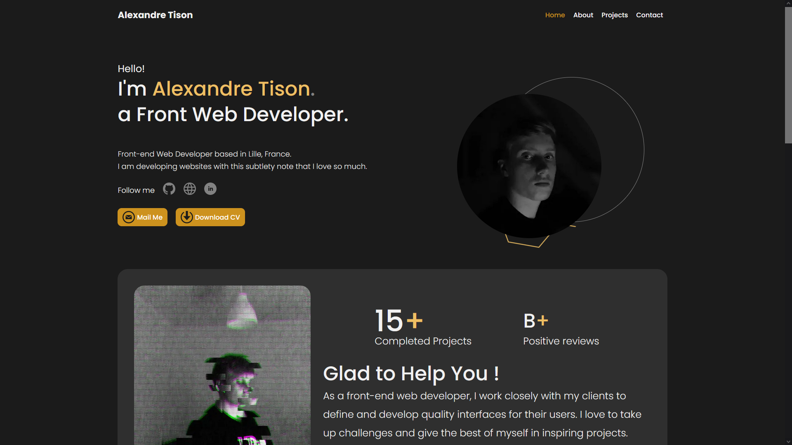

# Portfolio
> Version 4 of my portfolio.
> Live demo [_here_](https://alextison.github.io/alextisonPortfolio/).

## Table of Contents
- [Portfolio](#portfolio)
  - [Table of Contents](#table-of-contents)
  - [General Information](#general-information)
  - [Technologies Used](#technologies-used)
  - [Screenshots](#screenshots)
  - [Project Status](#project-status)
  - [Room for Improvement](#room-for-improvement)
  - [Acknowledgements](#acknowledgements)
  - [Contact](#contact)

## General Information
- I have already developed 3 versions of my portfolio but I was'nt completely satisfied with them
- That's why I decided to develope a brand new one to support my freelance project

## Technologies Used
- [SCSS](https://sass-lang.com/)
- [JS](https://www.javascript.com/)
- HTML

## Screenshots

## Project Status
Project is: _complete_.

## Room for Improvement

Room for improvement:
- SEO
- Good practices and code quality

To do:
- Develop a back-office

## Acknowledgements
- This project was inspired by an UI Kit available in the repository as UIKit.zip

## Contact
Created by [@alextison](https://github.com/alextison) - feel free to contact me!